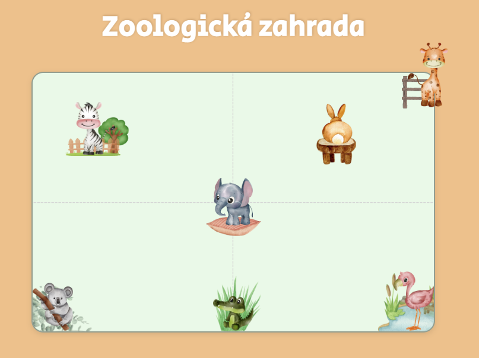

# Zoologická zahrada domácí úkol
*Vrať zvířata ze zoologické zahrady zpátky na svá místa podle předlohy. Úkol je na procvičování pozicování.*

*Dokumentace k pozicování: https://css-tricks.com/almanac/properties/p/position/*

## Jak postupovat
​
1. Projdi si HTML a podívej se na názvy tříd
2. Přejdi do CSS - máš zde připravené všechny třídy, které budeš stylovat
3. Odstavce, které jsou zakomentované, slouží jako nápověda
5. Pusť se do pozicování

## Pokud si nevíš s něčím rady máš dvě možnosti:
1. kontaktovat nás na Slacku
2. vydrž než zveřejníme řešení
​
*Úkol je dobrovolný.*
*Přejeme veselé kódění! 😊*
